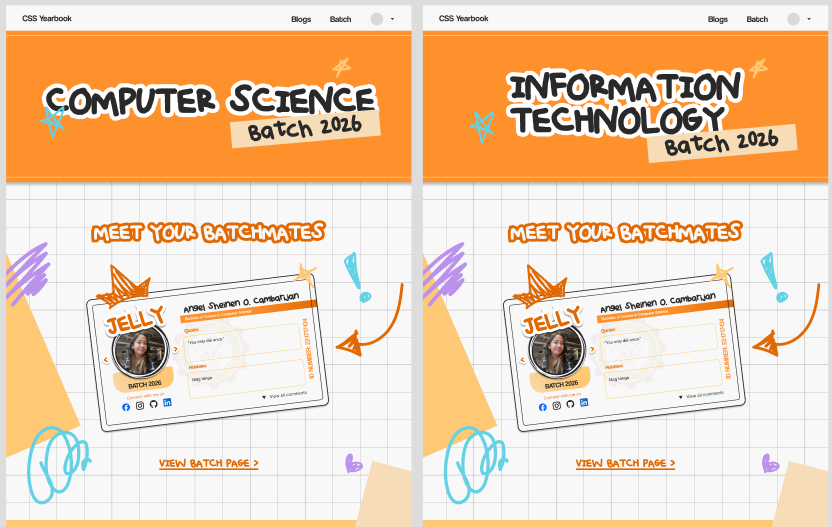

<a id="readme-top"></a>

[![Contributors][contributors-shield]][contributors-url]
[![Stargazers][stars-shield]][stars-url]

<!-- PROJECT LOGO -->
<br />
<div align="center">
  <a href="https://github.com/ShunMeizz/ccs-yearbook-esque-sps">
    
  </a>

  <h3 align="center">CCS YEARBOOK-ESQUE STUDENT PROFILE SYSTEM</h3>

  <p align="center">
    Prepared for CSIT327 - Information Management 2
  </p>
</div>

---

## Table of Contents

1. [About The Project](#about-the-project)
   - [Purpose](#purpose)
   - [UI/UX](#uiux)
   - [Functional Requirements](#functional-requirements)
   - [ERD](#erd)
   - [Gantt Chart](#gantt-chart)
   - [Built With](#built-with)
2. [Getting Started](#getting-started)
   - [Prerequisites and Installation](#prerequisites-and-installation)
   - [Setup Instructions](#setup-instructions)
     - [Setup the Django](#setup-the-django)
     - [Run the Development Server](#run-the-development-server)
3. [Top Contributors](#top-contributors)
4. [Contact](#contact)

---

# I. About The Project

- ### Purpose

The CCS Yearbook-esque Student Profile System is designed to provide a digital platform for students in the College of Computer Studies (CCS) to create and manage profiles, interact through comments, and engage in a blogging system.

- ### UI/UX
View more of the pages and designs in depth here:
[UI/UX](./ProjectDocumentation/FigmaUI_CCS_Yearbook_esque.pdf)
<div style="display: flex; gap: 10px;">



</div>


- ### Functional Requirements

The functional aspects of the system include:

1. User Account Management
2. Profile Management
3. Commenting System
4. Blogging System
5. Profile Filtering
6. Administrative Management
7. Report System

Detailed Information of the functional requirements can be read here:
[Functional Requirements](./ProjectDocumentation/FigmaUI_CCS_Yearbook_esque.pdf)

- ### ERD


- ### Gantt Chart

Detailed Information of the GanttChart can be read here:
[Gantt Chart](./ProjectDocumentation/GanttChart_CCS_Yearbook-esque_Student_Profile.pdf)

- ### Built With

[![HTML][HTML-shield]][HTML-url] [![CSS][CSS-shield]][CSS-url] [![JavaScript][JavaScript-shield]][JavaScript-url] [![Bootstrap][Bootstrap-shield]][Bootstrap-url] [![jQuery][JQuery-shield]][JQuery-url] [![Python][Python-shield]][Python-url] [![Django][Django-shield]][Django-url]

<p align="right">(<a href="#readme-top">back to top</a>)</p>

---

# II. Getting Started

- ### Prerequisites and Installation

Ensure you have the following installed on your computer:

1. **Python (v3.8 or higher)**

   - [Download Python](https://www.python.org/downloads/).
   - Verify installation:
     ```sh
     python --version
     pip --version
     ```

2. **Git**

   - [Download Git](https://git-scm.com/downloads) for version control.
   - Verify installation:
     ```sh
     git --version
     ```

3. **A Web Browser**  
   Use Chrome, Firefox, or Edge for testing.

### Setup Instructions

-#### Setup the Django

1. **Create a Virtual Environment**

   Run the following command to create a virtual environment:

   ```sh
   python -m venv venv
   ```

2. **Activate the Virtual Environment**

   On macOS/Linux:

   ```sh
   source venv/bin/activate
   ```

   On Windows:

   ```sh
   venv\Scripts\activate
   ```

3. **Install the Required Python Packages**

   Use the `requirements.txt` file to install all necessary dependencies:

   ```sh
   pip install -r requirements.txt
   ```

4. **Apply Database Migrations**
   Run the following command to set up the database:
   ```sh
   python manage.py migrate
   ```

-#### Run the Development Server

1. **Start the Django Backend**

   Run the following command to start the development server:

   ```sh
   python manage.py runserver
   ```

2. **Open the Application in Your Browser**
   Navigate to:
   ```sh
   http://localhost:8000
   ```

<p align="right">(<a href="#readme-top">back to top</a>)</p>

---

# III. Top Contributors

<a href="https://github.com/ShunMeizz/ccs-yearbook-esque-sps/graphs/contributors">
  
</a>

<p align="right">(<a href="#readme-top">back to top</a>)</p>

---

# IV. Contact

- **Angel Sheinen O. Cambarijan** - [GitHub](https://github.com/jellypedia) - angelsheinen.cambarijan@cit.edu
- **Charlene R. Repuesto** - [LinkedIn](https://www.linkedin.com/in/charlene-repuesto/) - charlene.repuesto@cit.edu
- **Shanley Mae F. Sebial** - [LinkedIn](https://www.linkedin.com/in/shanley-mae-sebial-966358305/) - shanleymae.sebial@cit.edu

Project Link: [https://github.com/ShunMeizz/ccs-yearbook-esque-sps](https://github.com/ShunMeizz/ccs-yearbook-esque-sps)

<p align="right">(<a href="#readme-top">back to top</a>)</p>

<!-- MARKDOWN LINKS & IMAGES -->
<!-- https://www.markdownguide.org/basic-syntax/#reference-style-links -->

[contributors-shield]: https://img.shields.io/github/contributors/ShunMeizz/ccs-yearbook-esque-sps.svg?style=for-the-badge
[contributors-url]: https://github.com/ShunMeizz/ccs-yearbook-esque-sps/graphs/contributors
[stars-shield]: https://img.shields.io/github/stars/ShunMeizz/ccs-yearbook-esque-sps?style=for-the-badge
[stars-url]: https://github.com/ShunMeizz/ccs-yearbook-esque-sps/stargazers
[HTML-shield]: https://img.shields.io/badge/-HTML-orange
[HTML-url]: https://developer.mozilla.org/en-US/docs/Web/HTML
[CSS-shield]: https://img.shields.io/badge/-CSS-blue
[CSS-url]: https://developer.mozilla.org/en-US/docs/Web/CSS
[JavaScript-shield]: https://img.shields.io/badge/-JavaScript-yellow
[JavaScript-url]: https://developer.mozilla.org/en-US/docs/Web/JavaScript
[Bootstrap-shield]: https://img.shields.io/badge/Bootstrap-563D7C?style=for-the-badge&logo=bootstrap&logoColor=white
[Bootstrap-url]: https://getbootstrap.com
[JQuery-shield]: https://img.shields.io/badge/jQuery-0769AD?style=for-the-badge&logo=jquery&logoColor=white
[JQuery-url]: https://jquery.com
[Python-shield]: https://img.shields.io/badge/-Python-blue
[Python-url]: https://www.python.org/
[Django-shield]: https://img.shields.io/badge/-Django-green
[Django-url]: https://www.djangoproject.com/
